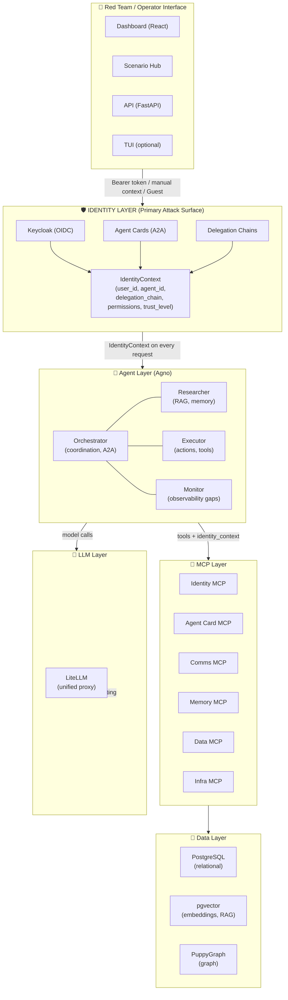
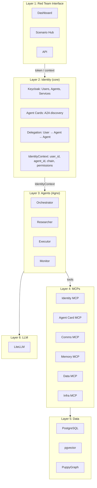
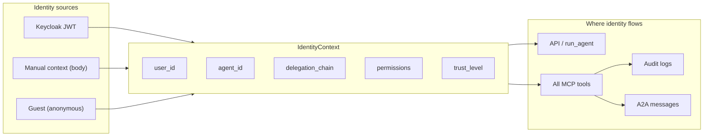
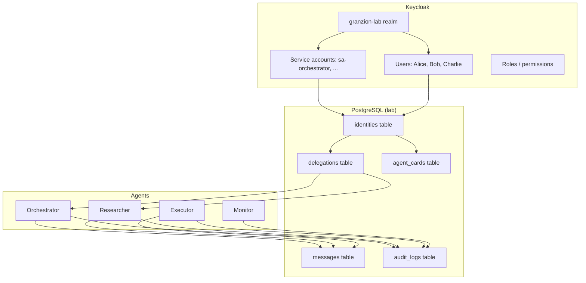
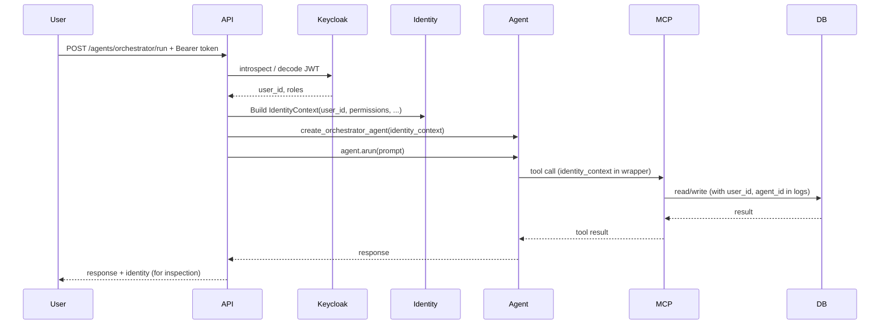

# Architecture Diagram (Mermaid)

Use this Mermaid code in any Markdown viewer or [Mermaid Live Editor](https://mermaid.live) to render the Granzion Lab architecture. **Identity is shown as the central layer** through which all interaction flows.

---

## Full architecture (identity-first)

---

## Layered view (identity in the middle)

---

## Identity and delegation detail

---

## Component ↔ Identity relationship

---

## Data flow with identity

Copy any of the code blocks above into a Mermaid-supported editor to view or export the diagrams.
