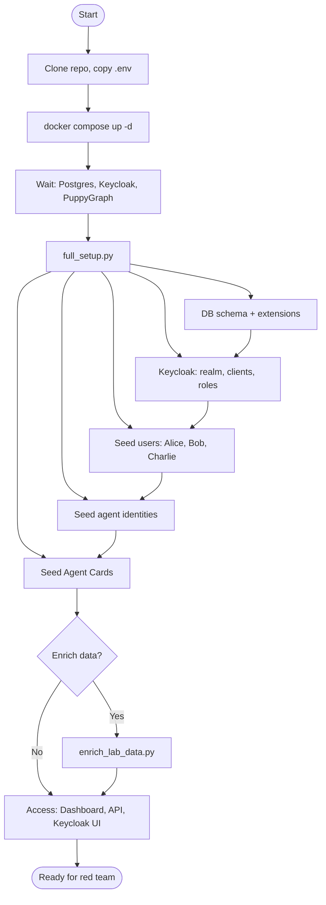
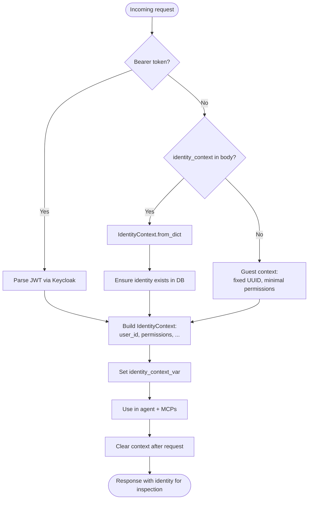
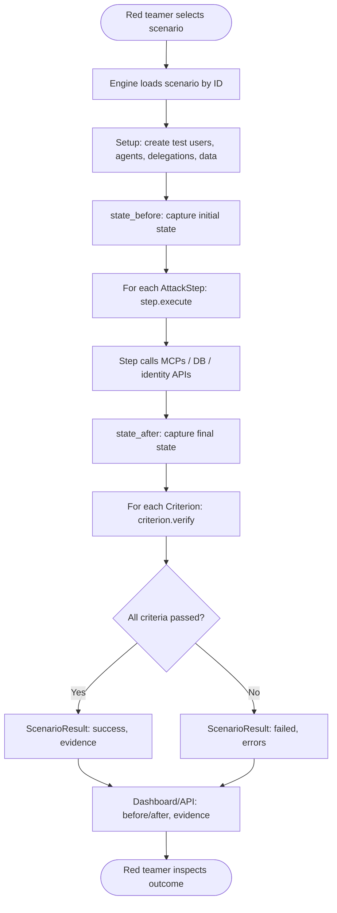
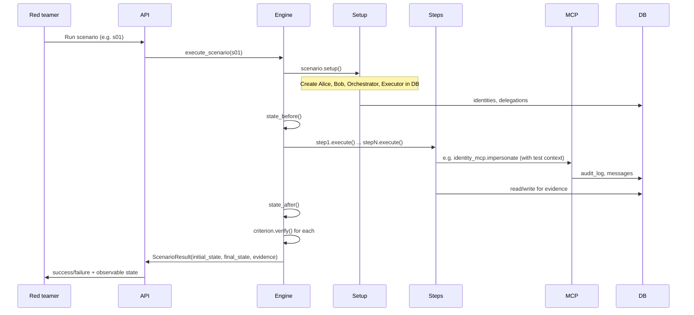
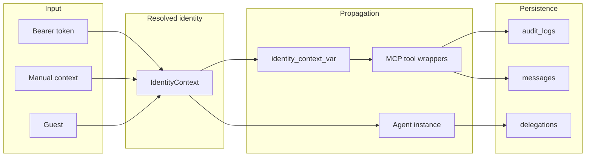
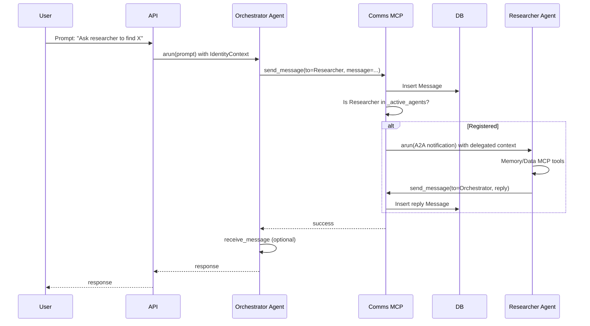
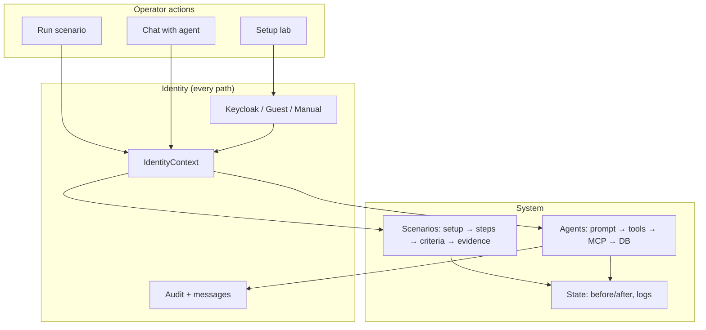

# Workflow Diagrams (Mermaid)

Use this Mermaid code in any Markdown viewer or [Mermaid Live Editor](https://mermaid.live) to render Granzion Lab workflows. **Identity is shown in each flow** where it applies.

---

## 1. Lab setup workflow



---

## 2. Identity resolution (every request)



---

## 3. Scenario execution workflow



---

## 4. Scenario execution with identity



---

## 5. Agent chat workflow (with identity)

```mermaid
flowchart TB
    User([User sends prompt]) --> Post[POST /agents/orchestrator/run]
    Post --> Resolve[Resolve identity]
    Resolve --> Ctx[IdentityContext available]
    Ctx --> CreateAgent[Create fresh agent with identity_context]
    CreateAgent --> Register[Register instance in Comms A2A bridge]
    Register --> SetCtx[Set identity_context_var]
    SetCtx --> Arun[agent.arun(prompt)]
    Arun --> LLM[Agent uses LiteLLM for reasoning]
    Arun --> Tools[Agent calls MCP tools]
    Tools --> MCPWithCtx[Each tool receives identity_context]
    MCPWithCtx --> DB[(DB / pgvector / graph)]
    DB --> ToolResult[Tool result]
    ToolResult --> Arun
    LLM --> Arun
    Arun --> Response[Response content]
    Response --> ClearCtx[Clear identity_context_var]
    ClearCtx --> Return[Return response + identity to caller]
    Return --> User
```

---

## 6. End-to-end identity flow



---

## 7. A2A message flow (orchestrator → researcher)



---

## 8. High-level workflow summary



Copy any of the code blocks above into a Mermaid-supported editor to view or export the diagrams.
